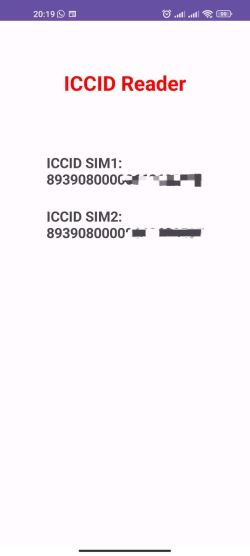

# ICCID Reader

## App functionalities
This Android application has the ability to read and print the ICCIDs of the SIM(s) of the smartphone with Android operating system. It works on Android versions up to 12 (API level 32), because from 13 onwards limitations have been introduced that prevent the Java classes used from reading this information from the SIM.

## ICCID
The ICCID (Integrated Circuit Card ID) is a 19-digit number that uniquely identifies each SIM in the phone.

## Approach followed
Initially we spent some time researching which Android packages could be right for us. We discovered that the **TelephonyManager** class, contained in the **android.telephony** package, has some very interesting and useful methods for our purposes (getIMEI, getUiccCardsInfo, getDevideId). Testing them, however, we have discovered that in the most recent versions of Android they are no longer usable without appropriate permissions that third-party applications cannot obtain. In particular, these methods are no longer available starting from Android 10.

So we started to analyze the **android.telecom** package, which is a framework responsible for managing calls on an Android device. In particular, we have used the **TelecomManager** class of this package.

## Used packages, classes and methods
The **TelecomManager** class of this package has some methods that seemed interesting to our purpose. The methods in question are:

- getOwnSelfManagedPhoneAccounts()
- getSelfManagedPhoneAccounts()
- getCallCapablePhoneAccounts()

These methods requires just the **Manifest.permission.READ_PHONE_STATE** which is available for 3rd party applications.

Among these three, we used **getCallCapablePhoneAccounts()**, that returns a list of **PhoneAccountHandles**. 
A **PhoneAccountHandle** is the unique identifier for a PhoneAccount, in fact it has the **getId()** method which returns a string that uniquely distinguishes this particular phone account.
This string is the ICCID of the SIM.

In the method documentation it is not clearly reported that the string returned coincides with the ICCID of the SIM. Only thanks to many tests, we were able to notice that this string coincided with the ICCID we were looking for.

In Dual-sim smartphones the getCallCapablePhoneAccounts() method returns a list of **two** elements, one for each inserted SIM.

## App screenshot
